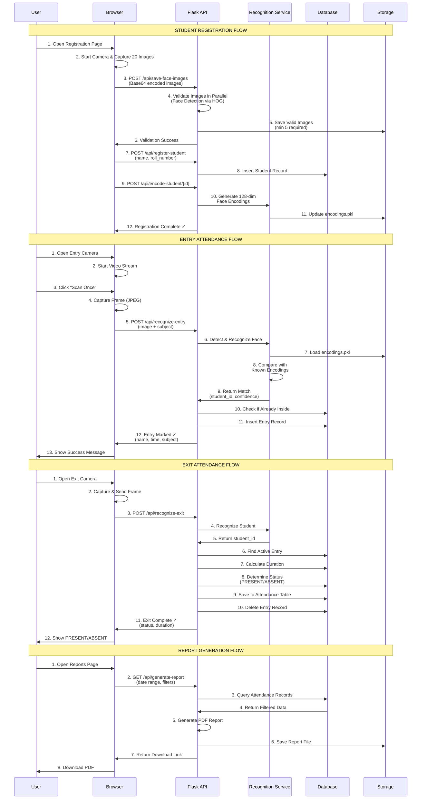
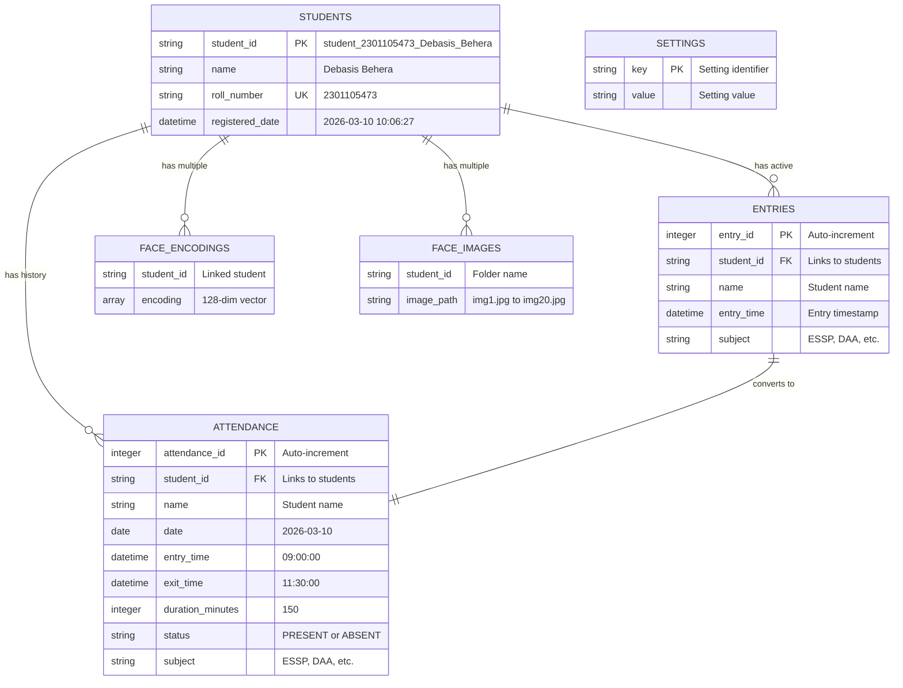
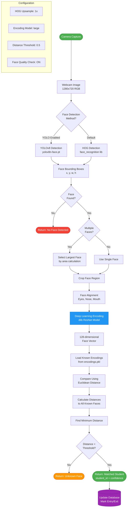

# Smart Attendance System - Architecture Documentation

This document provides a comprehensive visual overview of the Smart Attendance System architecture, including system components, data flows, database schema, and deployment architecture.

---

## Table of Contents

1. [Overall System Architecture](#1-overall-system-architecture)
2. [Data Flow Sequence Diagrams](#2-data-flow-sequence-diagrams)
3. [Project Structure](#3-project-structure)
4. [Database Schema](#4-database-schema)
5. [Face Recognition Pipeline](#5-face-recognition-pipeline)
6. [Deployment Architecture](#6-deployment-architecture)

---

## 1. Overall System Architecture

The system is organized into 5 main layers:

- **Client Layer**: Web browsers and camera feeds
- **Frontend Layer**: HTML/CSS/JavaScript user interfaces
- **API Layer**: Flask REST API with authentication and routing
- **Business Logic Layer**: Core services and managers
- **Data Layer**: SQLite database and file storage

```mermaid
graph TB
    subgraph "Client Layer"
        WEB[Web Browser]
        CAM1[Entry Camera Feed]
        CAM2[Exit Camera Feed]
    end

    subgraph "Frontend Layer"
        UI[Web Interface<br/>HTML/CSS/JavaScript]
        REG[Student Registration<br/>register.html/js]
        ENTRY[Entry Page<br/>entry.html/js]
        EXIT[Exit Page<br/>exit.html/js]
        DASH[Dashboard<br/>dashboard.html]
        ADMIN[Admin Panel<br/>admin.html]
        REPORTS[Reports<br/>reports.html/js]
    end

    subgraph "API Layer - Flask Backend"
        API[Flask Application<br/>app.py]
        WSGI[WSGI Server<br/>Waitress]
        
        subgraph "API Endpoints"
            AUTH[Authentication<br/>API Key Validation]
            REG_API[/api/register-student<br/>/api/save-face-images<br/>/api/encode-student]
            REC_API[/api/recognize-entry<br/>/api/recognize-exit]
            ATT_API[/api/mark-entry<br/>/api/mark-exit]
            ADMIN_API[/api/admin/*<br/>/api/students<br/>/api/settings]
            REPORT_API[/api/generate-report<br/>/api/student-attendance]
        end
    end

    subgraph "Business Logic Layer"
        ATT_MGR[Attendance Manager<br/>attendance_manager.py]
        DB_MGR[Database Manager<br/>database_manager.py]
        REC_SVC[Recognition Service<br/>recognition_service.py]
        FACE_ENC[Face Encoder<br/>encode_faces.py]
        FACE_COL[Face Data Collector<br/>collect_face_data.py]
        VALID[Validators<br/>validators.py]
        UTILS[Utilities<br/>utils.py<br/>Report Generator]
    end

    subgraph "Computer Vision Layer"
        FR[face_recognition<br/>Library]
        YOLO[YOLOv8<br/>Face Detection<br/>yolov8n-face.pt]
        CV[OpenCV<br/>cv2]
    end

    subgraph "Data Layer"
        DB[(SQLite Database<br/>attendance.db)]
        
        subgraph "Database Tables"
            STUDENTS[students<br/>student_id, name,<br/>roll_number]
            ENTRIES[entries<br/>entry_id, student_id,<br/>entry_time, subject]
            ATTENDANCE[attendance<br/>student_id, date,<br/>entry_time, exit_time,<br/>duration, status, subject]
            SETTINGS[settings<br/>key, value]
        end
        
        ENCODINGS[Face Encodings<br/>encodings.pkl<br/>128-dim vectors]
        DATASET[Face Images<br/>dataset/ folders<br/>JPG files]
        LOGS[System Logs<br/>system_logs.txt]
        REPORTS_DATA[Generated Reports<br/>PDF files]
    end

    %% Client to Frontend
    WEB --> UI
    CAM1 --> ENTRY
    CAM2 --> EXIT
    
    %% Frontend to API
    UI --> REG
    UI --> ENTRY
    UI --> EXIT
    UI --> DASH
    UI --> ADMIN
    UI --> REPORTS
    
    REG --> REG_API
    ENTRY --> REC_API
    EXIT --> REC_API
    DASH --> ADMIN_API
    ADMIN --> ADMIN_API
    REPORTS --> REPORT_API
    
    %% API Gateway
    REG_API --> API
    REC_API --> API
    ATT_API --> API
    ADMIN_API --> API
    REPORT_API --> API
    
    API --> AUTH
    API --> WSGI
    
    %% API to Business Logic
    API --> ATT_MGR
    API --> DB_MGR
    API --> REC_SVC
    API --> FACE_ENC
    API --> FACE_COL
    API --> VALID
    API --> UTILS
    
    %% Business Logic to CV
    REC_SVC --> FR
    REC_SVC --> YOLO
    REC_SVC --> CV
    FACE_ENC --> FR
    FACE_COL --> CV
    
    %% Business Logic to Data
    DB_MGR --> DB
    DB --> STUDENTS
    DB --> ENTRIES
    DB --> ATTENDANCE
    DB --> SETTINGS
    
    REC_SVC --> ENCODINGS
    FACE_ENC --> ENCODINGS
    FACE_ENC --> DATASET
    FACE_COL --> DATASET
    
    ATT_MGR --> DB_MGR
    UTILS --> REPORTS_DATA
    API --> LOGS
    
    %% Styling
    classDef frontend fill:#4CAF50,stroke:#2E7D32,stroke-width:2px,color:#fff
    classDef backend fill:#2196F3,stroke:#1565C0,stroke-width:2px,color:#fff
    classDef logic fill:#FF9800,stroke:#E65100,stroke-width:2px,color:#fff
    classDef cv fill:#9C27B0,stroke:#6A1B9A,stroke-width:2px,color:#fff
    classDef data fill:#F44336,stroke:#C62828,stroke-width:2px,color:#fff
    
    class REG,ENTRY,EXIT,DASH,ADMIN,REPORTS,UI frontend
    class API,WSGI,AUTH,REG_API,REC_API,ATT_API,ADMIN_API,REPORT_API backend
    class ATT_MGR,DB_MGR,REC_SVC,FACE_ENC,FACE_COL,VALID,UTILS logic
    class FR,YOLO,CV cv
    class DB,STUDENTS,ENTRIES,ATTENDANCE,SETTINGS,ENCODINGS,DATASET,LOGS,REPORTS_DATA data
```

---

## 2. Data Flow Sequence Diagrams

### Complete System Workflow

This sequence diagram shows the complete flow of data through the system for all major operations:



---

## 3. Project Structure

The project follows a modular structure with clear separation of concerns:

```mermaid
graph TD
    ROOT[Smart-Attendance-System/]
    
    ROOT --> DATA[data/]
    ROOT --> DOCS[docs/]
    ROOT --> MODELS[models/]
    ROOT --> SRC[src/]
    ROOT --> WEB[web/]
    ROOT --> CONFIG[Configuration Files]
    
    DATA --> DB[database/<br/>attendance.db]
    DATA --> DATASET[dataset/<br/>student_*/img*.jpg]
    DATA --> ENC[encodings/<br/>encodings.pkl]
    DATA --> LOGS[logs/<br/>system_logs.txt]
    DATA --> REPORTS[reports/<br/>*.pdf]
    
    DOCS --> API_DOC[BACKEND_API_GUIDE.md]
    DOCS --> DB_DOC[DATABASE_GUIDE.md]
    DOCS --> FE_DOC[FRONTEND_GUIDE.md]
    DOCS --> ML_DOC[MODEL_TRAINING_GUIDE.md]
    DOCS --> ARCH_DOC[ARCHITECTURE.md]
    
    MODELS --> YOLO_MODEL[yolov8n-face.pt<br/>YOLOv8 Face Detector]
    
    SRC --> AM[attendance_manager.py<br/>Attendance Logic]
    SRC --> CS[camera_source.py<br/>Camera Interface]
    SRC --> CFD[collect_face_data.py<br/>Data Collection]
    SRC --> CFG[config.py<br/>System Configuration]
    SRC --> DM[database_manager.py<br/>DB Operations]
    SRC --> EF[encode_faces.py<br/>Face Encoding]
    SRC --> EC[entry_camera.py<br/>Entry Processing]
    SRC --> EX[exit_camera.py<br/>Exit Processing]
    SRC --> RL[rate_limiter.py<br/>API Rate Limiting]
    SRC --> RS[recognition_service.py<br/>Face Recognition]
    SRC --> UT[utils.py<br/>Utilities & Reports]
    SRC --> VL[validators.py<br/>Input Validation]
    
    WEB --> APP[app.py<br/>Flask Application]
    WEB --> WSGI_FILE[wsgi.py<br/>Production Server]
    WEB --> STATIC[static/]
    WEB --> TEMPLATES[templates/]
    
    STATIC --> CSS[css/<br/>style.css]
    STATIC --> JS[js/]
    STATIC --> IMG[images/]
    
    JS --> MAIN_JS[main.js]
    JS --> ENTRY_JS[entry.js]
    JS --> EXIT_JS[exit.js]
    JS --> REG_JS[register.js]
    JS --> REPORT_JS[reports.js]
    JS --> SA_JS[student_attendance.js]
    
    TEMPLATES --> BASE[base.html]
    TEMPLATES --> DASH_T[dashboard.html]
    TEMPLATES --> ENTRY_T[entry.html]
    TEMPLATES --> EXIT_T[exit.html]
    TEMPLATES --> REG_T[register.html]
    TEMPLATES --> REP_T[reports.html]
    TEMPLATES --> ADM_T[admin.html]
    TEMPLATES --> SA_T[student_attendance.html]
    
    CONFIG --> REQ[requirements.txt<br/>Python Dependencies]
    CONFIG --> GUNI[gunicorn.conf.py<br/>Gunicorn Config]
    CONFIG --> README[README.md<br/>Documentation]
    
    style ROOT fill:#E3F2FD,stroke:#1976D2,stroke-width:3px
    style DATA fill:#FFF3E0,stroke:#F57C00,stroke-width:2px
    style DOCS fill:#F3E5F5,stroke:#7B1FA2,stroke-width:2px
    style MODELS fill:#E8F5E9,stroke:#388E3C,stroke-width:2px
    style SRC fill:#FFE0B2,stroke:#E64A19,stroke-width:2px
    style WEB fill:#E1F5FE,stroke:#0277BD,stroke-width:2px
    style CONFIG fill:#FCE4EC,stroke:#C2185B,stroke-width:2px
```



### Key Directories

- **`data/`**: All runtime data including database, face images, encodings, logs, and reports
- **`docs/`**: System documentation and guides
- **`models/`**: Pre-trained ML models (YOLOv8)
- **`src/`**: Core business logic and services
- **`web/`**: Flask web application, frontend, and API

---

## 4. Database Schema

The system uses SQLite with the following normalized schema:



### Table Relationships

- **Students → Entries**: One-to-many (a student can have multiple active entries for different subjects)
- **Students → Attendance**: One-to-many (a student has attendance records for each date/subject)
- **Entries → Attendance**: One-to-one (each entry converts to one attendance record upon exit)
- **Students → Face Encodings**: One-to-many (multiple face encodings per student for better accuracy)
- **Students → Face Images**: One-to-many (20 training images per student)

---

## 5. Face Recognition Pipeline

The face recognition system uses a multi-stage pipeline for accurate detection and matching:



### Recognition Accuracy Factors

1. **Face Detection**: YOLO provides faster detection, HOG is more reliable
2. **Face Quality**: Lighting, angle, and occlusion affect recognition
3. **Encoding Model**: "large" model provides 99.38% accuracy on LFW benchmark
4. **Distance Threshold**: 0.5 balances false positives vs false negatives
5. **Multiple Encodings**: 15-20 face samples per student improve matching

---

## 6. Deployment Architecture

The system is designed for deployment on a local network (campus/classroom):

```mermaid
graph TB
    subgraph "Client Devices"
        LAPTOP[Teacher Laptop<br/>Chrome/Edge Browser]
        TABLET[Tablet<br/>Entry Scanner]
        DESKTOP[Desktop PC<br/>Exit Scanner]
    end
    
    subgraph "Network Layer"
        LAN[Local Network<br/>192.168.x.x or<br/>Campus WiFi]
    end
    
    subgraph "Application Server - 0.0.0.0:5000"
        WAITRESS[Waitress WSGI Server<br/>4 Worker Threads<br/>180s Channel Timeout]
        
        WAITRESS --> FLASK[Flask Application<br/>app.py]
        
        FLASK --> MW1[Middleware: CORS Handler]
        FLASK --> MW2[Middleware: Rate Limiter]
        FLASK --> MW3[Middleware: Auth Validator]
        FLASK --> MW4[Middleware: Error Handler]
        
        FLASK --> ROUTE1[Routes: Registration]
        FLASK --> ROUTE2[Routes: Recognition]
        FLASK --> ROUTE3[Routes: Attendance]
        FLASK --> ROUTE4[Routes: Reports]
        FLASK --> ROUTE5[Routes: Admin]
    end
    
    subgraph "Business Services"
        SVC1[Recognition Service<br/>Face Detection & Matching]
        SVC2[Attendance Manager<br/>Entry/Exit Logic]
        SVC3[Database Manager<br/>CRUD Operations]
        SVC4[Face Encoder<br/>Training Pipeline]
    end
    
    subgraph "Data Storage - ./data/"
        DB[(SQLite Database<br/>attendance.db<br/>ACID Compliant)]
        
        FILES[File System]
        FILES --> F1[face_encodings.pkl<br/>Cached in Memory]
        FILES --> F2[dataset/<br/>Training Images]
        FILES --> F3[reports/<br/>Generated PDFs]
        FILES --> F4[logs/<br/>Rotating Logs]
    end
    
    subgraph "ML Models - ./models/"
        YOLO_M[yolov8n-face.pt<br/>Pre-trained YOLO]
        DLIB_M[dlib ResNet Model<br/>Built into face_recognition]
    end
    
    subgraph "System Resources"
        CPU[CPU: Intel/AMD<br/>4+ cores recommended]
        RAM[RAM: 4GB minimum<br/>8GB recommended]
        DISK[Storage: 2GB+<br/>SSD preferred]
        CAM[Webcam: 720p+<br/>USB/Built-in]
    end
    
    LAPTOP --> LAN
    TABLET --> LAN
    DESKTOP --> LAN
    
    LAN --> WAITRESS
    
    FLASK --> SVC1
    FLASK --> SVC2
    FLASK --> SVC3
    FLASK --> SVC4
    
    SVC1 --> YOLO_M
    SVC1 --> DLIB_M
    SVC1 --> F1
    
    SVC2 --> SVC3
    SVC3 --> DB
    
    SVC4 --> F1
    SVC4 --> F2
    
    FLASK --> F3
    FLASK --> F4
    
    WAITRESS -.->|Uses| CPU
    WAITRESS -.->|Uses| RAM
    SVC1 -.->|Uses| CPU
    SVC1 -.->|Uses| RAM
    FLASK -.->|Uses| DISK
    LAPTOP -.->|Provides| CAM
    TABLET -.->|Provides| CAM
    DESKTOP -.->|Provides| CAM
    
    style WAITRESS fill:#2196F3,stroke:#1565C0,color:#fff
    style FLASK fill:#4CAF50,stroke:#2E7D32,color:#fff
    style DB fill:#F44336,stroke:#C62828,color:#fff
    style YOLO_M fill:#9C27B0,stroke:#6A1B9A,color:#fff
    style SVC1 fill:#FF9800,stroke:#E65100,color:#fff
    style LAN fill:#00BCD4,stroke:#00838F,color:#fff
```



### Deployment Specifications

**Server Requirements:**
- **CPU**: 4+ cores recommended (Intel i5/i7 or AMD Ryzen 5/7)
- **RAM**: 4GB minimum, 8GB recommended
- **Storage**: 2GB+ free space (SSD preferred for better performance)
- **OS**: Windows 10/11, Linux (Ubuntu 20.04+), macOS

**Network Setup:**
- **Server**: Runs on `0.0.0.0:5000` (accessible from all network interfaces)
- **Client Access**: Via local IP (e.g., `http://192.168.1.100:5000`)
- **Security**: Optional API key authentication, rate limiting enabled

**Production Server:**
- **WSGI**: Waitress (cross-platform) or Gunicorn (Linux/macOS)
- **Workers**: 4 threads for concurrent request handling
- **Timeouts**: 180s channel timeout for long-running operations
- **Logging**: Rotating file logs with 10MB max size

**Camera Requirements:**
- **Resolution**: 720p minimum, 1080p recommended
- **Frame Rate**: 30 FPS for smooth video
- **Compatibility**: Any USB webcam or built-in laptop camera

---

## Technology Stack Summary

### Backend
- **Framework**: Flask 3.0+
- **WSGI Server**: Waitress / Gunicorn
- **Database**: SQLite 3
- **Face Recognition**: face_recognition library (dlib)
- **Face Detection**: YOLOv8 (optional), HOG (default)
- **Computer Vision**: OpenCV (cv2)
- **PDF Generation**: ReportLab

### Frontend
- **HTML5**: Semantic structure
- **CSS3**: Custom styling with CSS variables
- **JavaScript**: Vanilla ES6+ (no frameworks)
- **WebRTC**: getUserMedia API for camera access

### ML/AI Models
- **Face Encoding**: dlib ResNet (128-dimensional vectors)
- **Face Detection**: YOLOv8n-face (6.4MB pre-trained model)
- **Recognition Accuracy**: 99.38% on LFW benchmark

### Security Features
- API key authentication (optional)
- Rate limiting (configurable)
- CORS support for cross-origin requests
- Input validation and sanitization
- SQL injection prevention (parameterized queries)

---

## Performance Characteristics

- **Registration Time**: 15-20 seconds per student (20 images)
- **Recognition Speed**: <2 seconds per face (HOG), <1 second (YOLO)
- **Concurrent Users**: Up to 100 simultaneous connections
- **Database Size**: ~10KB per student (excluding images)
- **Image Storage**: ~2MB per student (20 images at 100KB each)
- **Encoding File**: ~15KB per student (128-dim float32 arrays)

---

## Scalability Considerations

### Current Limitations
- SQLite single-writer limitation (suitable for <100 students)
- File-based encoding storage (reloaded on server restart)
- Single-server deployment (no horizontal scaling)

### Future Improvements
- Switch to PostgreSQL/MySQL for multi-writer support
- Redis/Memcached for encoding cache
- Load balancer for multiple server instances
- Cloud storage (S3/Azure Blob) for images
- WebSocket for real-time updates

---

## Related Documentation

- [Backend API Guide](BACKEND_API_GUIDE.md) - Complete API endpoint documentation
- [Database Guide](DATABASE_GUIDE.md) - Database schema and queries
- [Frontend Guide](FRONTEND_GUIDE.md) - UI components and JavaScript modules
- [Model Training Guide](MODEL_TRAINING_GUIDE.md) - Face encoding and training process
- [README](../README.md) - Installation and setup instructions

---

**Document Version**: 1.0  
**Last Updated**: March 10, 2026  
**Maintained by**: Smart Attendance System Team
